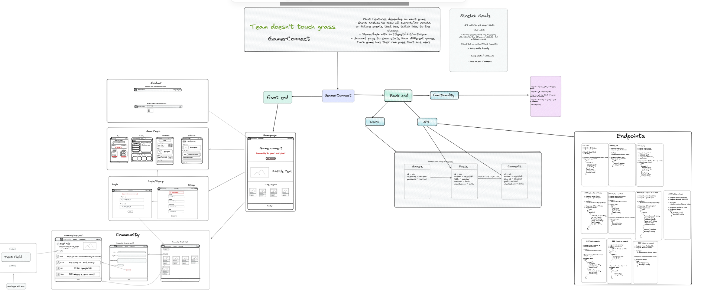
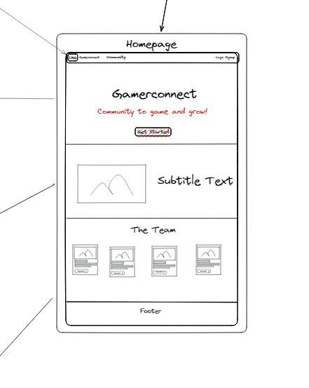
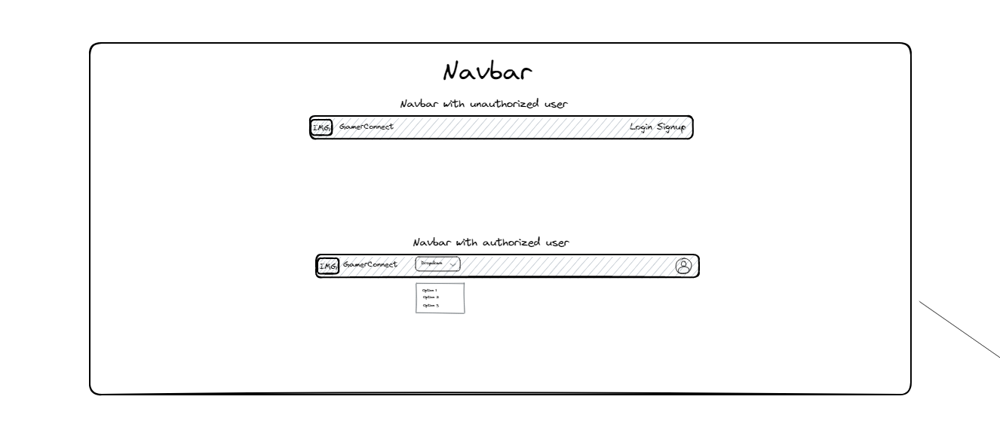
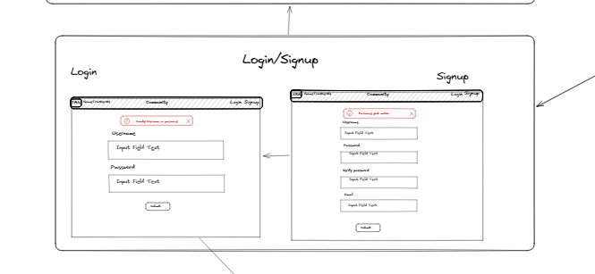

# Overall Frontend Design

## WireFrames

### Homepage

Our homepage is created with a get started button and also cards that show the developers that create this application.

### Navbar

The user can sign up or login from the navbar, once logged in, they can see a dropdown that has access to the list of posts other gamers/users have created.

### Login/Signup

From our mainpage, the user has no access to anything besides sign and logging in. The user may click 'getting started' in order to sign up, or login from the navbar if they already have an account.

### Posts page

Once logged in, user can:
- Look at posts
- filter posts to their desired game
- create a post
- look at a post's details

